# Дипломный практикум в Yandex.Cloud
# Никулин Адександр FOPS-15
  * [Цели:](#цели)
  * [Этапы выполнения:](#этапы-выполнения)
     * [Создание облачной инфраструктуры](#создание-облачной-инфраструктуры)
     * [Создание Kubernetes кластера](#создание-kubernetes-кластера)
     * [Создание тестового приложения](#создание-тестового-приложения)
     * [Подготовка cистемы мониторинга и деплой приложения](#подготовка-cистемы-мониторинга-и-деплой-приложения)
     * [Установка и настройка CI/CD](#установка-и-настройка-cicd)
  * [Что необходимо для сдачи задания?](#что-необходимо-для-сдачи-задания)
  * [Как правильно задавать вопросы дипломному руководителю?](#как-правильно-задавать-вопросы-дипломному-руководителю)

---
## Цели:

<details>
  <summary>Раскрыть</summary>

  1. Подготовить облачную инфраструктуру на базе облачного провайдера Яндекс.Облако.
  2. Запустить и сконфигурировать Kubernetes кластер.
  3. Установить и настроить систему мониторинга.
  4. Настроить и автоматизировать сборку тестового приложения с использованием Docker-контейнеров.
  5. Настроить CI для автоматической сборки и тестирования.
  6. Настроить CD для автоматического развёртывания приложения.

</details>

---

## Этапы выполнения:

### Создание облачной инфраструктуры

<details>
  <summary>Задача</summary>

  Для начала необходимо подготовить облачную инфраструктуру в ЯО при помощи [Terraform](https://www.terraform.io/).

  Особенности выполнения:

  - Бюджет купона ограничен, что следует иметь в виду при проектировании инфраструктуры и использовании ресурсов;
  Для облачного k8s используйте региональный мастер(неотказоустойчивый). Для self-hosted k8s минимизируйте ресурсы ВМ и долю ЦПУ. В обоих вариантах используйте прерываемые ВМ для worker nodes.

  Предварительная подготовка к установке и запуску Kubernetes кластера.

  1. Создайте сервисный аккаунт, который будет в дальнейшем использоваться Terraform для работы с инфраструктурой с необходимыми и достаточными правами. Не стоит использовать права суперпользователя
  2. Подготовьте [backend](https://developer.hashicorp.com/terraform/language/backend) для Terraform:  
    а. Рекомендуемый вариант: S3 bucket в созданном ЯО аккаунте(создание бакета через TF)
    б. Альтернативный вариант:  [Terraform Cloud](https://app.terraform.io/)
  3. Создайте конфигурацию Terrafrom, используя созданный бакет ранее как бекенд для хранения стейт файла. Конфигурации Terraform для создания сервисного аккаунта и бакета и основной инфраструктуры следует сохранить в разных папках.
  4. Создайте VPC с подсетями в разных зонах доступности.
  5. Убедитесь, что теперь вы можете выполнить команды `terraform destroy` и `terraform apply` без дополнительных ручных действий.
  6. В случае использования [Terraform Cloud](https://app.terraform.io/) в качестве [backend](https://developer.hashicorp.com/terraform/language/backend) убедитесь, что применение изменений успешно проходит, используя web-интерфейс Terraform cloud.

  Ожидаемые результаты:

  1. Terraform сконфигурирован и создание инфраструктуры посредством Terraform возможно без дополнительных ручных действий, стейт основной конфигурации сохраняется в бакете или Terraform Cloud
  2. Полученная конфигурация инфраструктуры является предварительной, поэтому в ходе дальнейшего выполнения задания возможны изменения.

</details>

<details>
  <summary>Решение</summary>

  > Для начала был подготовлен новый репозиторий: https://github.com/ADNikulin/devops-diplov-yandexcloud \
  > В данном репозитории будут лежать конфиги развертывания инрфаструктуры и её настроек. Для тестоового приложения будет свой репозиторий. ВОзможно имело бы смысл делать на все этапы свои репозитории, но пока сделаем так. \
  > Для работы с данным репозиторием предпологается, что  у вас должен быть настроен тот или иной доступ к яндекс облаку без жесткого указания токена в конфигах. 
  > Так как у меня имеется имеется настроенный коннект с яндекс облаком, где я периодически генерирую токен для доступа \
  > - 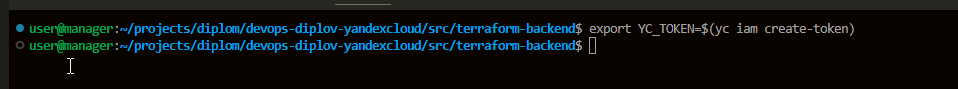
  > то приступим. \
  > Был подготовлен сервисный аккаунт c бэкендом и [террафом](https://github.com/ADNikulin/devops-diplov-yandexcloud/tree/master/src/terraform-backend) для его создания:
  > - [providers.tf](https://github.com/ADNikulin/devops-diplov-yandexcloud/blob/master/src/terraform-backend/providers.tf): конфигурация яндекс провайдера
  > - [service_account.tf](https://github.com/ADNikulin/devops-diplov-yandexcloud/blob/master/src/terraform-backend/service_account.tf): Настройки сервис аккаунта
  > - [variables.tf](https://github.com/ADNikulin/devops-diplov-yandexcloud/blob/master/src/terraform-backend/variables.tf): Описание доступных переменных с их дефолтными значениями
  > - [bucket.tf](https://github.com/ADNikulin/devops-diplov-yandexcloud/blob/master/src/terraform-backend/bucket.tf): Настрйока бакета для хранения стейта. Тут так же настроены экспорты токенов для сервисного аккаунта, при его создание подготовлены скрипты для экспорта токенов доступа к стейту и ключ доступа для работы от имени сервсиного аккаунта. Все ключи экспортируются в .tfvars который игнорируется при пуше в гит.
  > Запускаем инициализацию, создание и првоеряем созданные ресурсы:
  > - 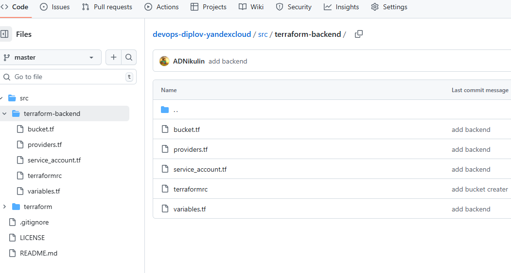
  > - 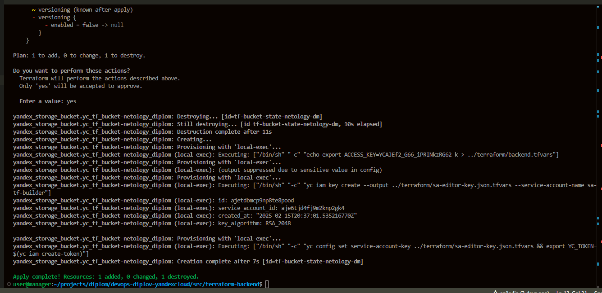
  > - 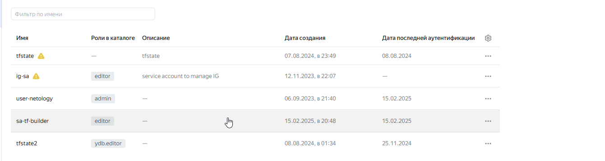
  > - 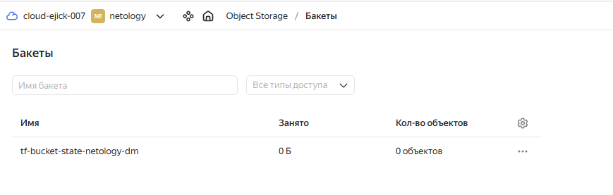
  > - 

  > \
  > \
  > Для дальнейшей работы определимся с составом. Так как цель - развернуть кубер, и учитывая то что по заданию нам не нужен продвинутый кластер + нужна экономия ресов, то выбран подход 1 + 2. Где 1 это мастер, 2 воркера. Начнем с этого. Так же стейт надо хранить в бакете, иметь 2 подсети в разных зонах. Это будет базовыое наполнение, которое в прцоессе будет меняться или дополняться. \
  > \
  > После первой настройки переходим в основную [директорию](https://github.com/ADNikulin/devops-diplov-yandexcloud/tree/master/src/terraform) с разверткой инфраструктуры. Наполнение следующее: 
  > - [providers.tf](https://github.com/ADNikulin/devops-diplov-yandexcloud/blob/master/src/terraform/providers.tf): конфигурация яндекс провайдера
  > - [variables.tf](https://github.com/ADNikulin/devops-diplov-yandexcloud/blob/master/src/terraform/variables.tf): Описание доступных переменных с их дефолтными значениями
  > - [vars.tf](https://github.com/ADNikulin/devops-diplov-yandexcloud/blob/master/src/terraform/vars.tf): Дополнительные переменные для описания настроек инфраструктуры
  > - [outputs.tf](https://github.com/ADNikulin/devops-diplov-yandexcloud/blob/master/src/terraform/outputs.tf): Выходные данные
  > - [network.tf](https://github.com/ADNikulin/devops-diplov-yandexcloud/blob/master/src/terraform/network.tf): Настройки VPC, делается одна network + 2 подсети в разных зонах
  > - [k8s-worker.tf](https://github.com/ADNikulin/devops-diplov-yandexcloud/blob/master/src/terraform/k8s-worker.tf): конфигурация машин для кубера воркер, конфигурация машин осуществляется в текущем файле
  > - [k8s-masters.tf](https://github.com/ADNikulin/devops-diplov-yandexcloud/blob/master/src/terraform/k8s-masters.tf): конфигурация машин для кубера master, конфигурация машин осуществляется в текущем файле
  > - [ansible.tf.tf](https://github.com/ADNikulin/devops-diplov-yandexcloud/blob/master/src/terraform/ansible.tf.tf): После поднятия машин, передает настройки в темплейт файл который в последствии готовит inventory для кубера.
  > - [backend.tf](https://github.com/ADNikulin/devops-diplov-yandexcloud/blob/master/src/terraform/backend.tf): Доступ к стейту
  > - [cloud-init.yml](https://github.com/ADNikulin/devops-diplov-yandexcloud/blob/master/src/terraform/init/cloud-init.yml): базовые настройки для поднимаемых машин, ключи доступа тянутся из [vars.tf](https://github.com/ADNikulin/devops-diplov-yandexcloud/blob/master/src/terraform/vars.tf) ssh-keys, тут же прописывается откуда тянуть ключ. + Дополнительно устанавливается пак вспомогательных программ на машину для удобства.
  > - [hosts.tftpl](https://github.com/ADNikulin/devops-diplov-yandexcloud/blob/master/src/terraform/templates/hosts.tftpl): Шаблон для генерации inventory файла
  > \
  > Перед запуском необходимо проделать пару вещей, это инициализировать новый токен и прокинуть токены для работы со стейтом:
  > Так как у нас идет автоматическое создание ключа для сервисного аккаунта и установка ег ов текущий профиль \
  > 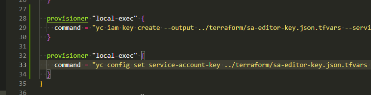
  > то сгенерим для него новый IAM токен
  > - 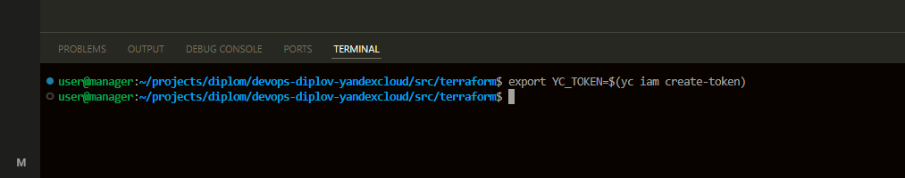
  > - и экспортируем токены из файла backend.tfvars (Хотя по идее можно автоматом их экспортировать после создания сервисного аккаунта)
  > - 
  > Теперь необходимо инициализировать терраформ для новой инфры под нужным SA: 
  > ```
  > terraform init -backend-config="access_key=$ACCESS_KEY" -backend-config="secret_key=$SECRET_KEY"
  > ``` 
  > После инициализации наш стейт связан с нашим бакетом. Будем запускать создание инфры и првоерим всё ли создалось то что нам надо и указано: 
  > - 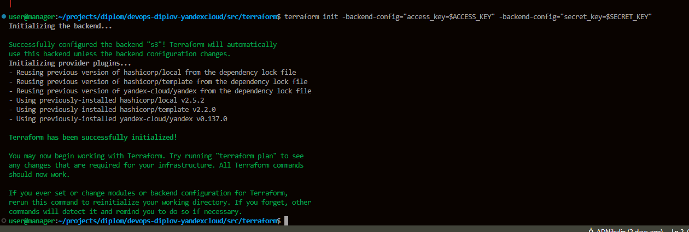
  > - 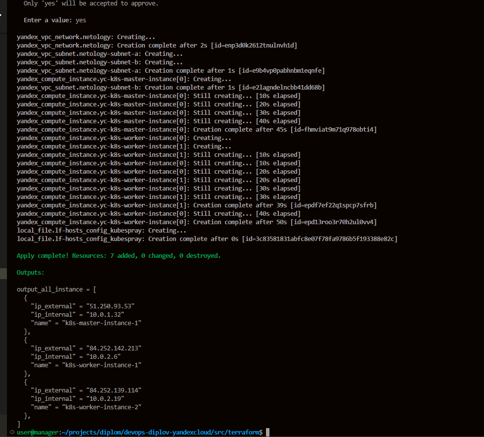
  > - 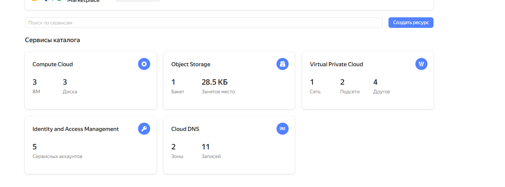
  > - 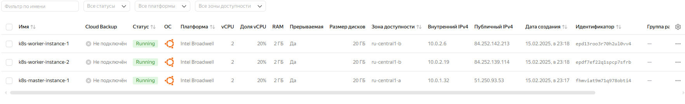
  > - 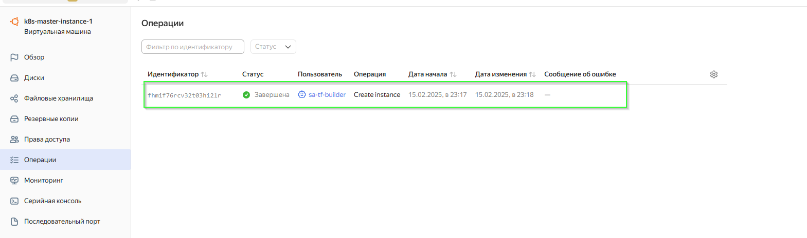
  > - 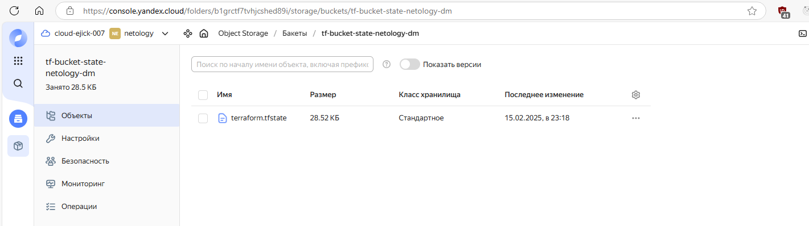
  > - 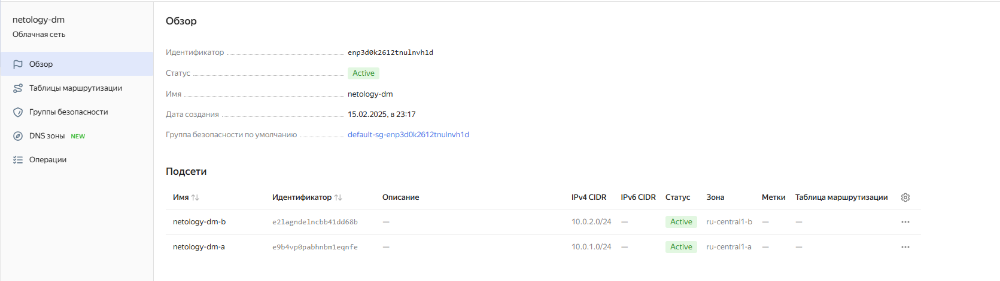
  > - 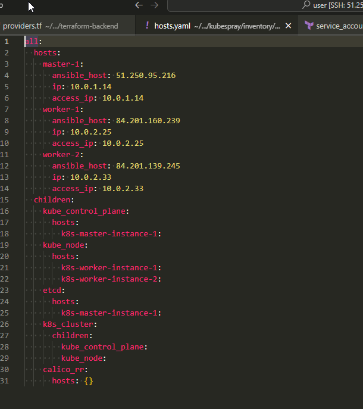
  > \
  > Все ресурсы были подготовлены, файл с inventory для кубера так же готов. Теперь првоерим удаление: 
  > - 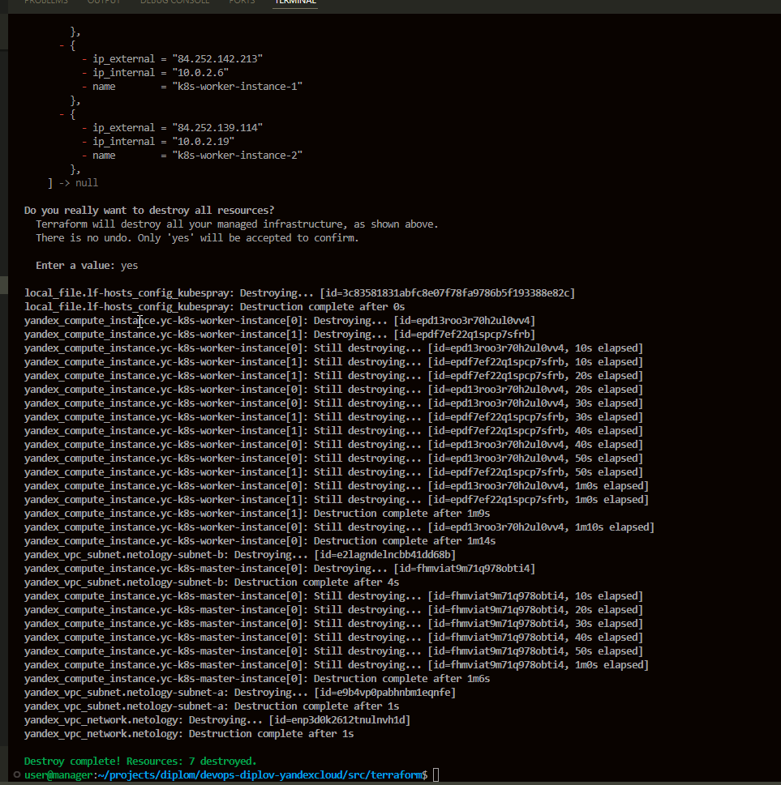
  > - 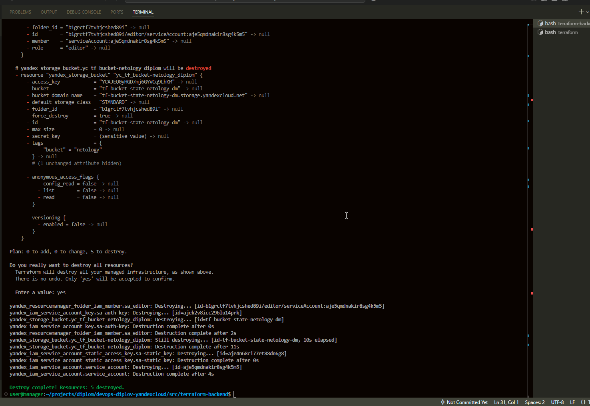
  > Удаление так же работает. \
  > В общем поднимем всё заново и будем переходить к следующему шагу. 

</details>

---

### Создание Kubernetes кластера

<details>
  <summary>Задача</summary>

  На этом этапе необходимо создать [Kubernetes](https://kubernetes.io/ru/docs/concepts/overview/what-is-kubernetes/) кластер на базе предварительно созданной инфраструктуры.   Требуется обеспечить доступ к ресурсам из Интернета.

  Это можно сделать двумя способами:

  1. Рекомендуемый вариант: самостоятельная установка Kubernetes кластера.  
    а. При помощи Terraform подготовить как минимум 3 виртуальных машины Compute Cloud для создания Kubernetes-кластера. Тип виртуальной машины следует выбрать самостоятельно с учётом требовании к производительности и стоимости. Если в дальнейшем поймете, что необходимо сменить тип инстанса, используйте Terraform для внесения изменений.  
    б. Подготовить [ansible](https://www.ansible.com/) конфигурации, можно воспользоваться, например [Kubespray](https://kubernetes.io/docs/setup/production-environment/tools/kubespray/)  
    в. Задеплоить Kubernetes на подготовленные ранее инстансы, в случае нехватки каких-либо ресурсов вы всегда можете создать их при помощи Terraform.
  2. Альтернативный вариант: воспользуйтесь сервисом [Yandex Managed Service for Kubernetes](https://cloud.yandex.ru/services/managed-kubernetes)  
    а. С помощью terraform resource для [kubernetes](https://registry.terraform.io/providers/yandex-cloud/yandex/latest/docs/resources/kubernetes_cluster) создать **региональный** мастер kubernetes с размещением нод в разных 3 подсетях      
    б. С помощью terraform resource для [kubernetes node group](https://registry.terraform.io/providers/yandex-cloud/yandex/latest/docs/resources/kubernetes_node_group)
    
  Ожидаемый результат:

  1. Работоспособный Kubernetes кластер.
  2. В файле `~/.kube/config` находятся данные для доступа к кластеру.
  3. Команда `kubectl get pods --all-namespaces` отрабатывает без ошибок.
  
</details>

<details>
  <summary>Решение</summary>
  
  > Для развертывания кубера будем использовать подход: [Kubespray](https://kubernetes.io/docs/setup/production-environment/tools/kubespray/). \
  > Для этого клонируем репозиторий рядом с terraform директорией: 
  > - 
  > Проверяем что файл hosts - (полученный после первой итерации) находится на месте. 
  > - 
  > переходим в папку и делаем предварительную подготовку для запуска кубера: \
  > Следуя инструкции: https://kubespray.io/#/docs/ansible/ansible?id=installing-ansible начал подготовку kubespray \
  > Создал environment + установил всё что идет в requirements.txt: 
  > ```
  > user@manager:~/projects/diplom/devops-diplov-yandexcloud/src/kubespray$ VENVDIR=kubespray-venv
  > user@manager:~/projects/diplom/devops-diplov-yandexcloud/src/kubespray$ KUBESPRAYDIR=/home/user/projects/diplom/devops-diplov-yandexcloud/src/kubespray
  > user@manager:~/projects/diplom/devops-diplov-yandexcloud/src/kubespray$ python3 -m venv $VENVDIR
  > user@manager:~/projects/diplom/devops-diplov-yandexcloud/src/kubespray$ source $VENVDIR/bin/activate
  > user@manager:~/projects/diplom/devops-diplov-yandexcloud/src/kubespray$ cd $KUBESPRAYDIR
  > user@manager:~/projects/diplom/devops-diplov-yandexcloud/src/kubespray$ pip install -U -r requirements.txt
  > ``` 
  > Проверим так же доступность хостов через энсибл пинг
  > - 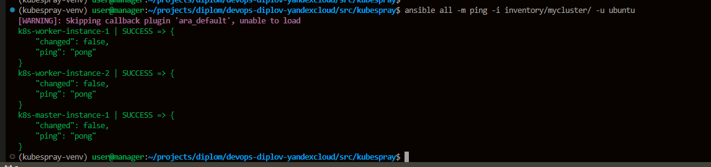
  > Ну а после запускаем установку через энсибл
  > ``` ansible-playbook -i inventory/mycluster/ cluster.yml -b -v -u ubuntu ``` \
  > - 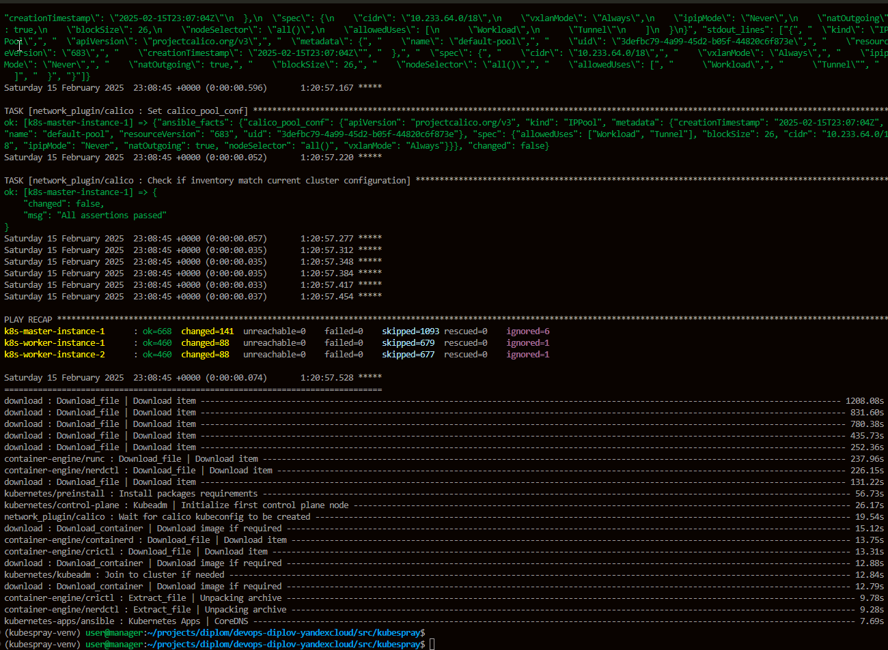
  > Спустя некоторое время всё готово. Далее будем подключаться и готовить конфиг файл для кластера. Для этого нам необходимо создать директорию, скопировать в неё базовый конфиг от кубера и скорректировать права. 
  > - 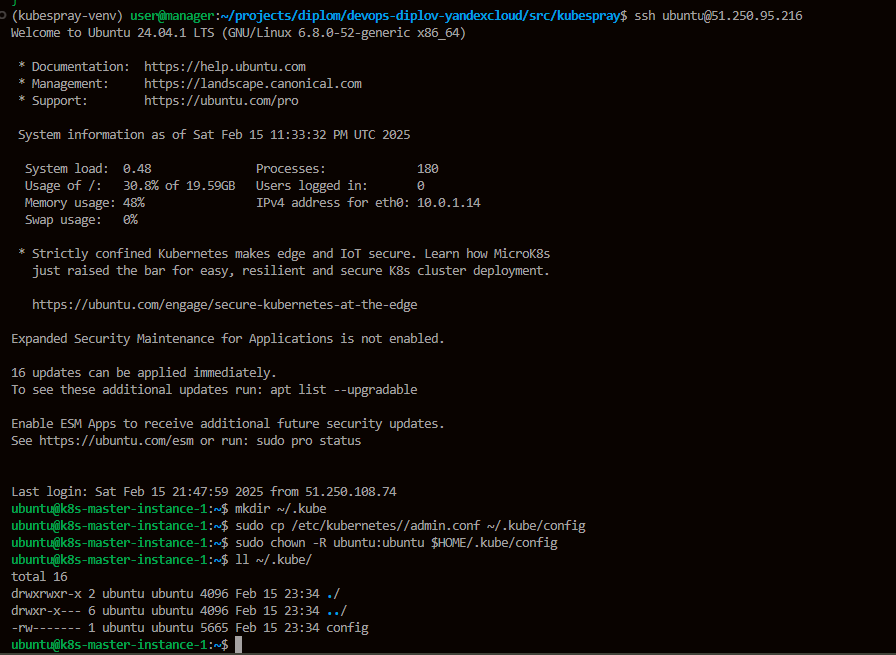
  > Ну и проверим всё ли норм. 
  > - 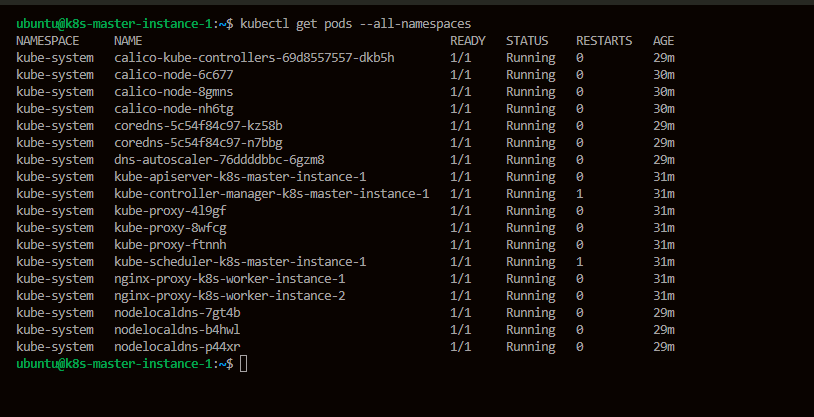
  > - 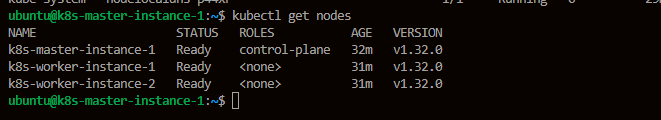

</details>

---

### Создание тестового приложения

<details>
  <summary>Задача</summary>

  Для перехода к следующему этапу необходимо подготовить тестовое приложение, эмулирующее основное приложение разрабатываемое вашей компанией.

  Способ подготовки:

  1. Рекомендуемый вариант:  
    а. Создайте отдельный git репозиторий с простым nginx конфигом, который будет отдавать статические данные.  
    б. Подготовьте Dockerfile для создания образа приложения.  
  2. Альтернативный вариант:  
    а. Используйте любой другой код, главное, чтобы был самостоятельно создан Dockerfile.

  Ожидаемый результат:

  1. Git репозиторий с тестовым приложением и Dockerfile.
  2. Регистри с собранным docker image. В качестве регистри может быть DockerHub или [Yandex Container Registry](https://cloud.yandex.ru/services/container-registry), созданный также с помощью terraform.

</details>

<details>
  <summary>Решение</summary>

  > Для этого шага был подготовлен репозиторий: [diplom-app](https://github.com/ADNikulin/diplom-app). Данный репозиторий это всего лишь набор статических файлов, которые далее будут собираться в образ с использованием nginx. 
  > - 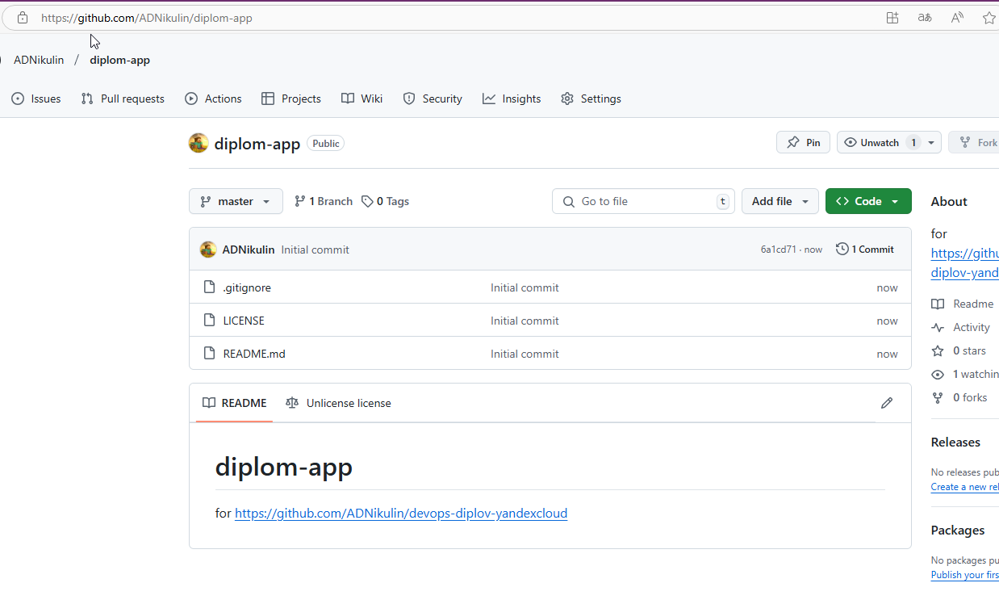
  > Затянем репозиторий на машину:
  > - 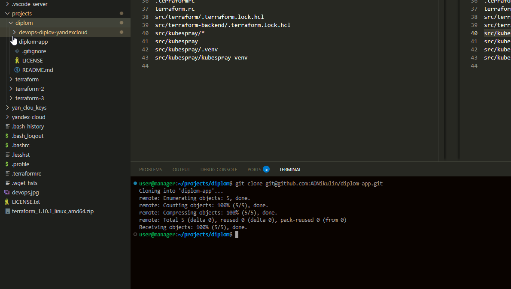
  > Далее подготовим наше тестовое приложение:
  > Структура данного репозитория: 
  > - [src](https://github.com/ADNikulin/diplom-app/tree/master/src) - набор файлов для статики
  > - [dockerfile](https://github.com/ADNikulin/diplom-app/blob/master/Dockerfile) - Файл для сборки образа. 
  > ```
  > FROM nginx:1.27.0
  > 
  > RUN rm -rf /usr/share/nginx/html/*
  > COPY src/ /usr/share/nginx/html/
  > 
  > EXPOSE 80
  > ```
  > 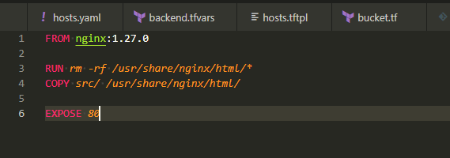
  > - [index.html](https://github.com/ADNikulin/diplom-app/blob/master/src/index.html) - Начальная HTML страничка для проекта
  > - [script.js](https://github.com/ADNikulin/diplom-app/blob/master/src/script.js) - JS код для реализации игры minesweeper
  > - [style.css](https://github.com/ADNikulin/diplom-app/blob/master/src/style.css) - Набор стилей для игры
  > \
  > Это базовое наполнение приложения, в последствие его немного поменяем. Так как буду использовать докерхаб для хранения своего приложения, то законнектимся к нему: 
  > - 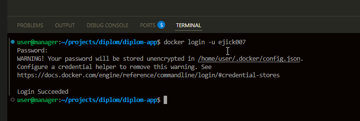
  > Подготовим новый репозиторий на [докерхабе](https://hub.docker.com/repository/docker/ejick007/diplom-app/general)
  > - 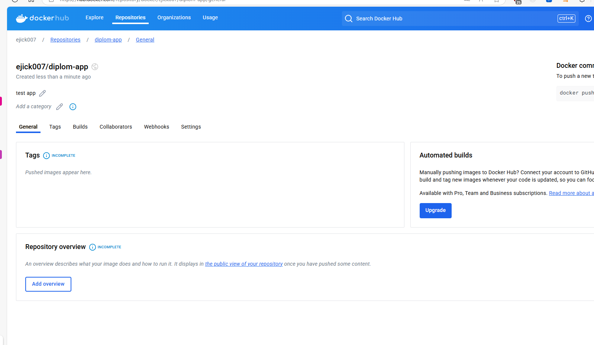
  > Теперь соберем приложение и првоерим что он у нас появился на машине
  > - 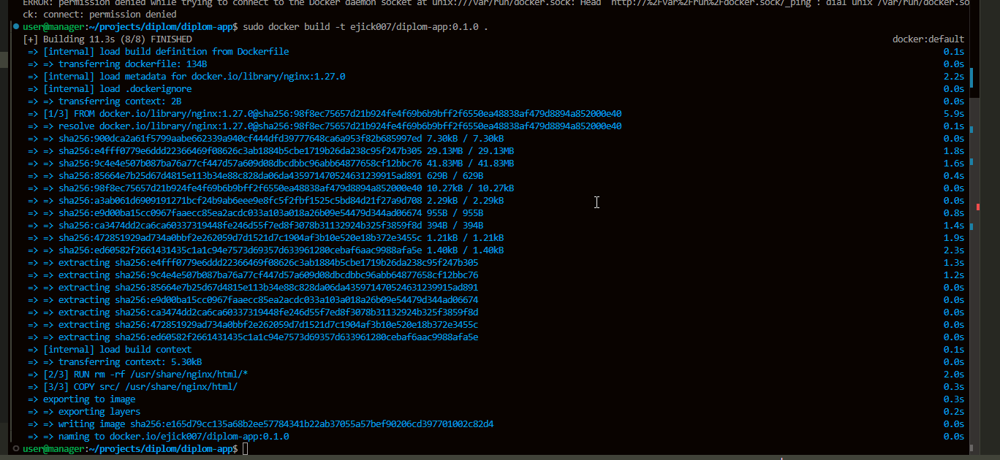
  > - 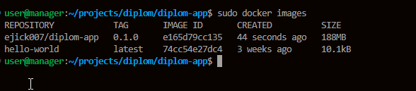
  > И отправляем в registry: 
  > - 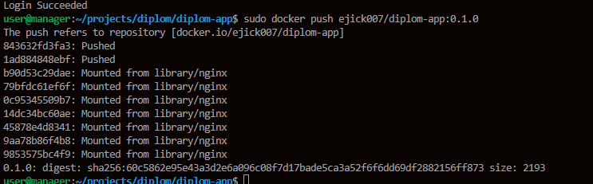
  > - 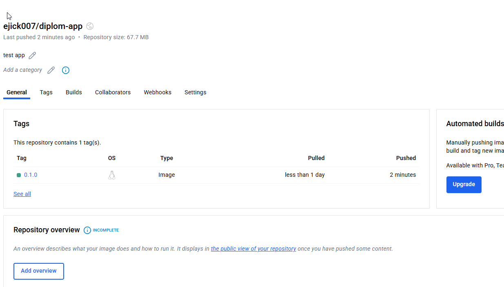
  > \
  > Результаты этапа: 
  > 1. [Git репозиторий](https://github.com/ADNikulin/diplom-app) с тестовым приложением и [Dockerfile](https://github.com/ADNikulin/diplom-app/blob/master/Dockerfile).
  > 2. [Регистри](https://hub.docker.com/repository/docker/ejick007/diplom-app/general) с собранным [docker image](https://hub.docker.com/repository/docker/ejick007/diplom-app/tags/0.1.0/sha256-60c5862e95e43a3d2e6a096c08f7d17bade5ca3a52f6f6dd69df2882156ff873).

</details>

---

### Подготовка cистемы мониторинга и деплой приложения

<details>
  <summary>Задача</summary>

  Уже должны быть готовы конфигурации для автоматического создания облачной инфраструктуры и поднятия Kubernetes кластера.  
  Теперь необходимо подготовить конфигурационные файлы для настройки нашего Kubernetes кластера.

  Цель:
  1. Задеплоить в кластер [prometheus](https://prometheus.io/), [grafana](https://grafana.com/), [alertmanager](https://github.com/prometheus/alertmanager), [экспортер](https://github.com/prometheus/node_exporter) основных метрик Kubernetes.
  2. Задеплоить тестовое приложение, например, [nginx](https://www.nginx.com/) сервер отдающий статическую страницу.

  Способ выполнения:
  1. Воспользоваться пакетом [kube-prometheus](https://github.com/prometheus-operator/kube-prometheus), который уже включает в себя [Kubernetes оператор](https://operatorhub.io/) для [grafana](https://grafana.com/), [prometheus](https://prometheus.io/), [alertmanager](https://github.com/prometheus/alertmanager) и [node_exporter](https://github.com/prometheus/node_exporter). Альтернативный вариант - использовать набор helm чартов от [bitnami](https://github.com/bitnami/charts/tree/main/bitnami).

  2. Если на первом этапе вы не воспользовались [Terraform Cloud](https://app.terraform.io/), то задеплойте и настройте в кластере [atlantis](https://www.runatlantis.io/) для отслеживания изменений инфраструктуры. Альтернативный вариант 3 задания: вместо Terraform Cloud или atlantis настройте на автоматический запуск и применение конфигурации terraform из вашего git-репозитория в выбранной вами CI-CD системе при любом комите в main ветку. Предоставьте скриншоты работы пайплайна из CI/CD системы.

  Ожидаемый результат:
  1. Git репозиторий с конфигурационными файлами для настройки Kubernetes.
  2. Http доступ на 80 порту к web интерфейсу grafana.
  3. Дашборды в grafana отображающие состояние Kubernetes кластера.
  4. Http доступ на 80 порту к тестовому приложению.
  
</details>

<details>
  <summary>Решение</summary>

  > На данном этапе мы имеем кластер + регистри с готовым докер файлом. \
  > Для систем монитринга был выбран [kube-prometheus-stack](https://github.com/prometheus-community/helm-charts/tree/main/charts/kube-prometheus-stack). Действуем по инструкции и проивзодим установку через helm.
  > ```bash
  > $ helm repo add prometheus-community https://prometheus-community.github.io/helm-charts
  > $ helm repo update
  > ```
  > - 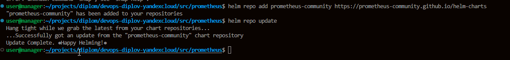
  > Далее подготовим файл со значениями для промстека, заменив базовые креды для доступа к графане в [values.yaml](src/prometheus/values.yaml), сам файл берется [отсюда](https://github.com/prometheus-community/helm-charts/blob/main/charts/kube-prometheus-stack/values.yaml). Так же в рамках команды создадим и сразу новый неймспейс **monitoring** и будем размещать данный инсанс на порту 30001: 
  > - 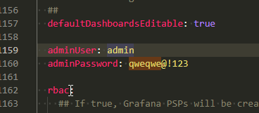
  > - 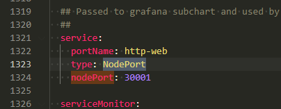
  > ```bash
  > $ helm upgrade --install monitoring prometheus-community/kube-prometheus-stack --create-namespace -n monitoring -f ./values.yaml
  > ```
  > - 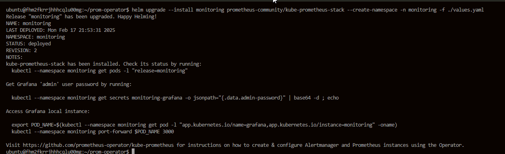
  > равертывание произошло, проверяем.
  > - 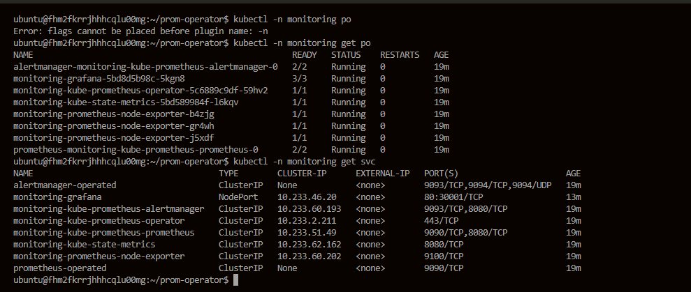
  > - 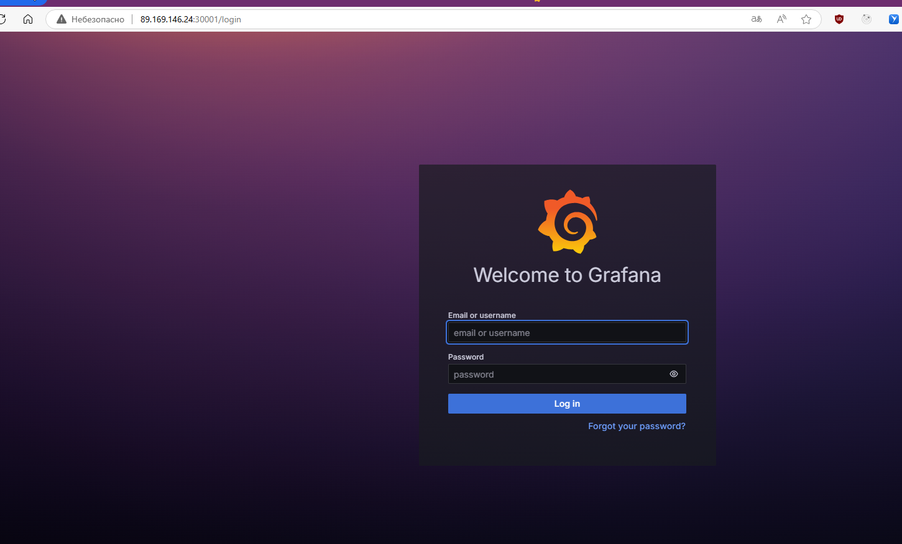
  > - 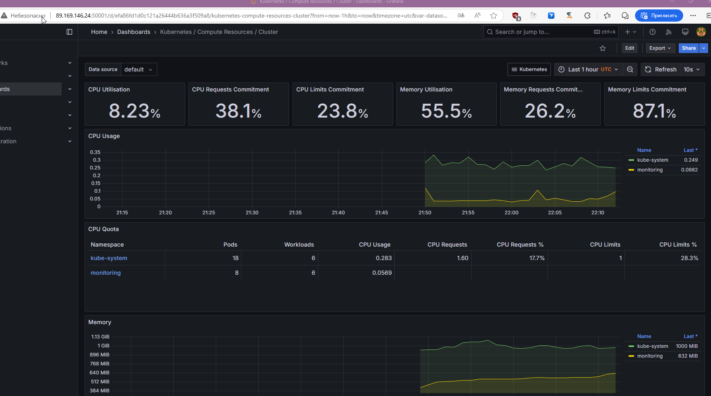
  > \
  > Теперь приступи к развертыванию приложения. Подготовим два файлика: 
  > - [app.deployment.yaml](src/app/app.deployment.yaml) - в image указываем ссылку на готовый образ [ejick007/diplom-app:0.1.0](https://hub.docker.com/repository/docker/ejick007/diplom-app/tags/0.1.0/sha256-60c5862e95e43a3d2e6a096c08f7d17bade5ca3a52f6f6dd69df2882156ff873)
  > - [app.service.yaml](src/app/app.service.yaml) - СЕрвис, который будет размещаться на порту 30002
  > - + подготовим новый неймспейс: production
  > - 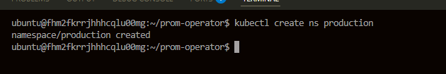
  > После всей подготовки, запускаем деплой и проверяем результаты: 
  > - 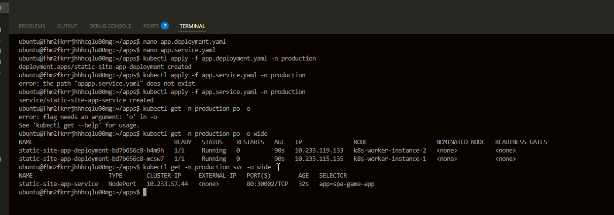
  > - 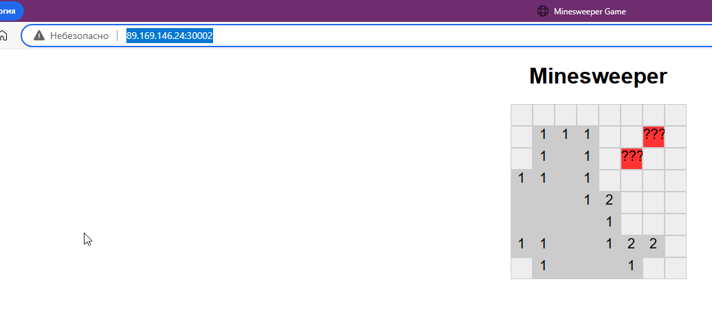
  > \ 
  > Доступ к приложениям имеется с разных нод. Поэтому сделаем балансировщик и запихнем туда все ноды нашего кластера. Дорабатываем терраформ и запускаем его обновление. Далее проверяем доступы: 
  > - [load-balancer.tf](src/terraform/load-balancer.tf) - создаем целевую группу и два балансировщика с маппингом портов. Для веб приложения с 300001 на 80, для графаны с 30002 на 3000
  > - 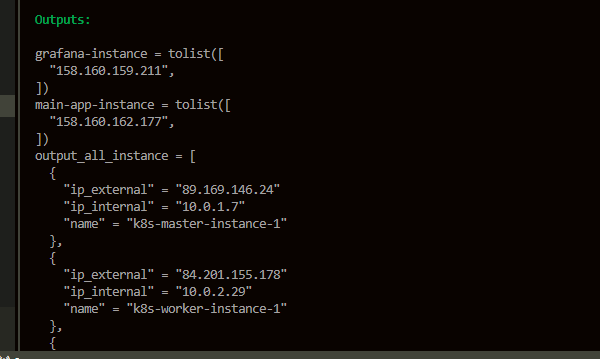
  > - 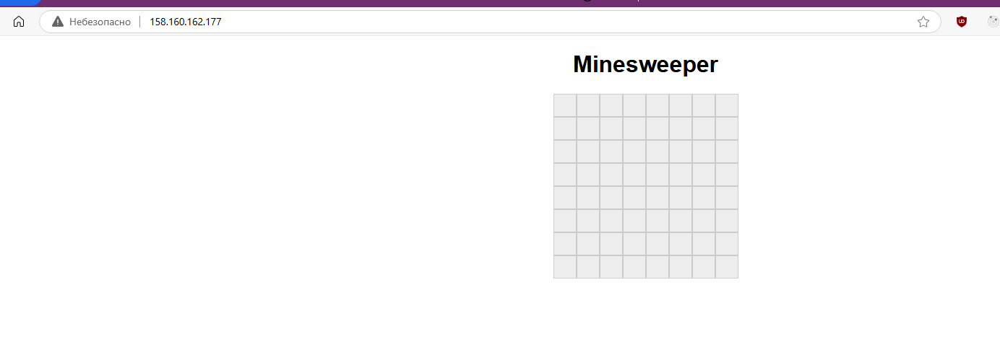
  > - 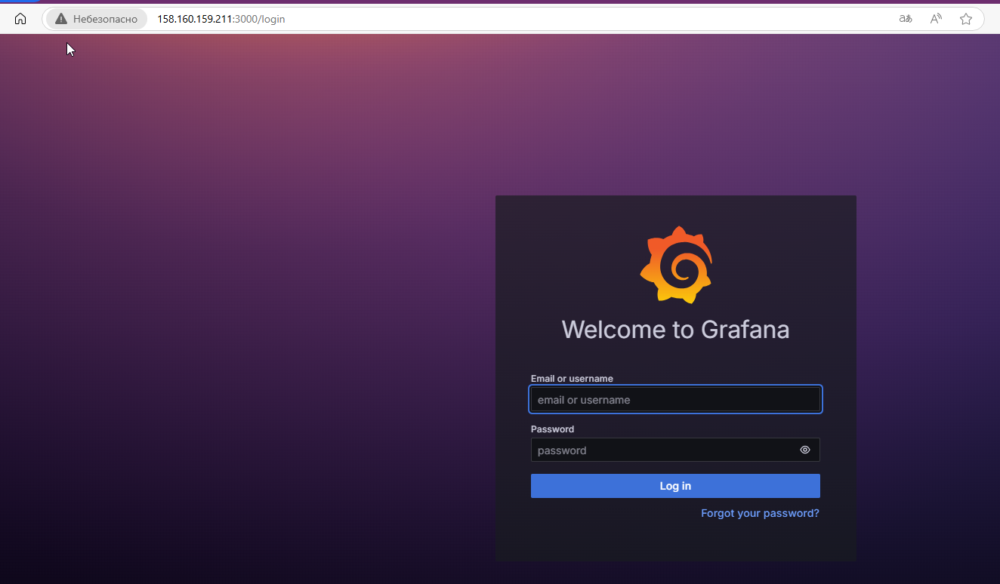
  > /
  > (мысли вслух) Пока выполнял эту часть работы, понял что надо было сделать публичные и приватные подсети. Создать собственно бастион, а кластер разместить в приватных сетях. настройку кластера и сети производить через бастион, как и получать досутп к сети так же через него. При этом балансировщик настроить на кластер кубера ну или HA proxy настроить на нем. Как минимум так на мой взгляд было бы правильнее скорее всего. В общем может переделаю в отдельной ветке. 
  > /
  > Когда писал резульатты, понял что графану настроил на 3000 порт. А по факту там свой балансировщик и можно настроит ьна 80 порт. Переделал: 
  > - 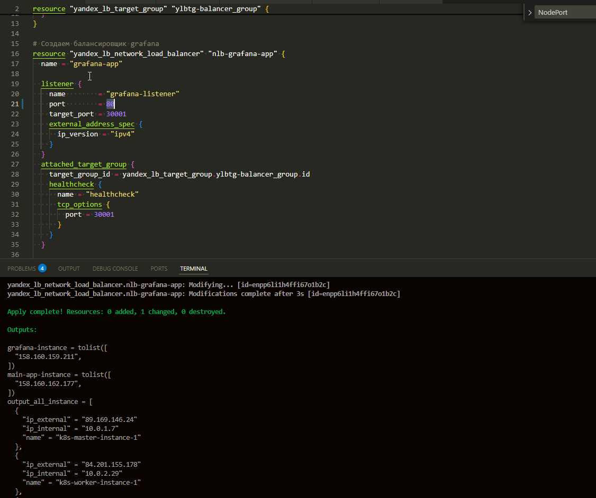
  > - 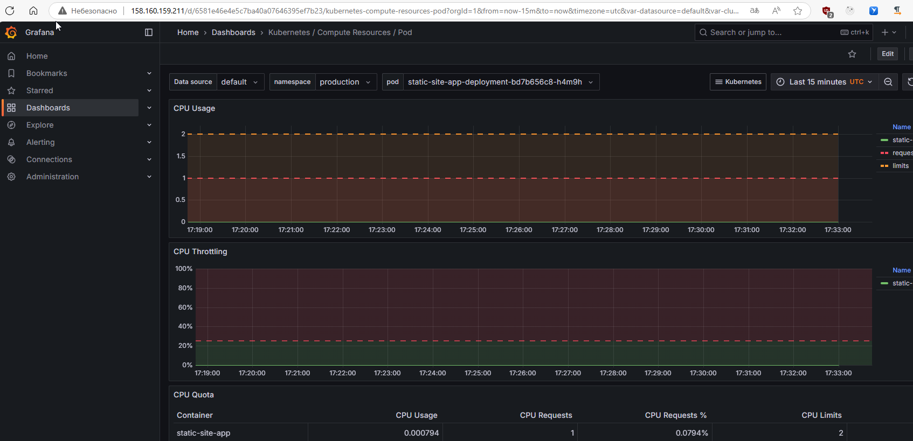
  > /
  > Результаты этапа: (Предоставленные IP на скринах в настройке ественно будут отличаться от тех что прдеставлены на результатах, так как для тестирования и разработки применял прерываемые машины, и IP меняются. 
  > 1. Git репозиторий с конфигурационными файлами для настройки Kubernetes. В моем случае формирирование занимается https://github.com/kubernetes-sigs/kubespray. Сам Inventory формируется при запуске с помощью [hosts.tftpl](src/terraform/templates/hosts.tftpl).
  > 2. Http доступ на 80 порту к web интерфейсу grafana. - http://158.160.159.211/ (admin / qweqwe@!123)
  > 3. Дашборды в grafana отображающие состояние Kubernetes кластера. - http://158.160.159.211/dashboards
  > 4. Http доступ на 80 порту к тестовому приложению. - http://158.160.162.177/

</details>

---

### Установка и настройка CI/CD

<details>
  <summary>Задача</summary>

  Осталось настроить ci/cd систему для автоматической сборки docker image и деплоя приложения при изменении кода.

  Цель:

  1. Автоматическая сборка docker образа при коммите в репозиторий с тестовым приложением.
  2. Автоматический деплой нового docker образа.

  Можно использовать [teamcity](https://www.jetbrains.com/ru-ru/teamcity/), [jenkins](https://www.jenkins.io/), [GitLab CI](https://about.gitlab.com/stages-devops-lifecycle/continuous-integration/) или GitHub Actions.

  Ожидаемый результат:

  1. Интерфейс ci/cd сервиса доступен по http.
  2. При любом коммите в репозиторие с тестовым приложением происходит сборка и отправка в регистр Docker образа.
  3. При создании тега (например, v1.0.0) происходит сборка и отправка с соответствующим label в регистри, а также деплой соответствующего Docker образа в кластер Kubernetes.
  
</details>

<details>
  <summary>Решение</summary>
  
  > Так как у меня есть аккаунт в гитлабе, то буду использовать его. \
  > Для начала создадим проект на гитлбае и импортируем туда проект из github. 
  > - 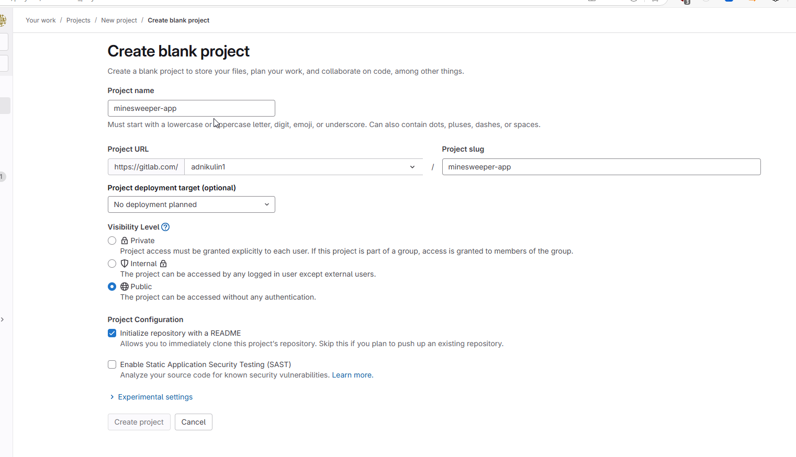
  > - 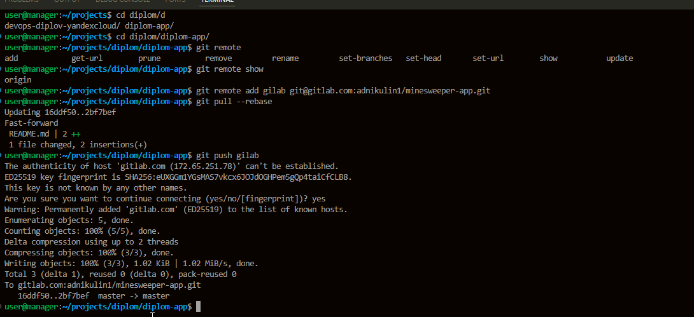
  > - Результат: https://gitlab.com/adnikulin1/minesweeper-app
  > Теперь репозиторий гитлаба содержит актуальный код и будем работать с ним. Далее нам нужен будет раннер для того что бы билдить проект и что-то с ним делать. Сделаем свой раннер в нашем k8s. 
  > - Создаеc новый раннер в проекте и создаем егов кубере.
  > - 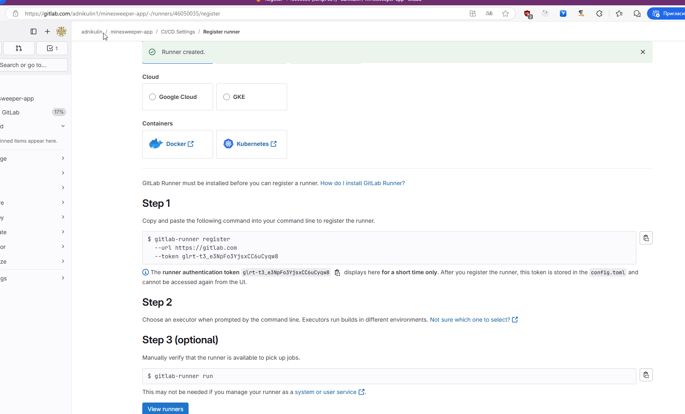
  > - Обновим helm
  > - 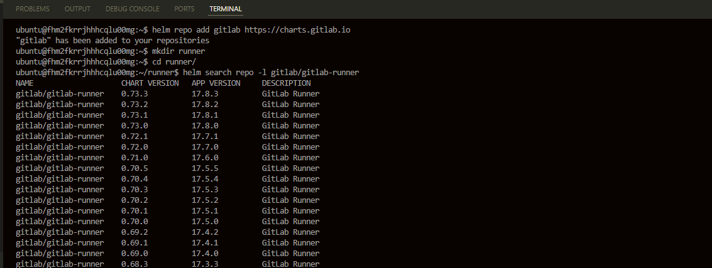
      ```bash
      helm repo add gitlab https://charts.gitlab.io
      helm repo add gitlab https://charts.gitlab.io
      helm search repo -l gitlab/gitlab-runner
      helm repo update gitlab
      ```
  > - выполлняем команды для создания раннера через helm + так же создадим отдельный неймспейс 
      ```bash
      kubectl create namespace builders
      helm install --namespace builders gitlab-runner gitlab/gitlab-runner \
        --set rbac.create=true \
        --set runners.privileged=true \
        --set gitlabUrl=https://gitlab.com/ \
        --set runnerRegistrationToken=glrt-t3_siwtUHRvWV6wBhLJUSd
      ```
  > - 
  > - 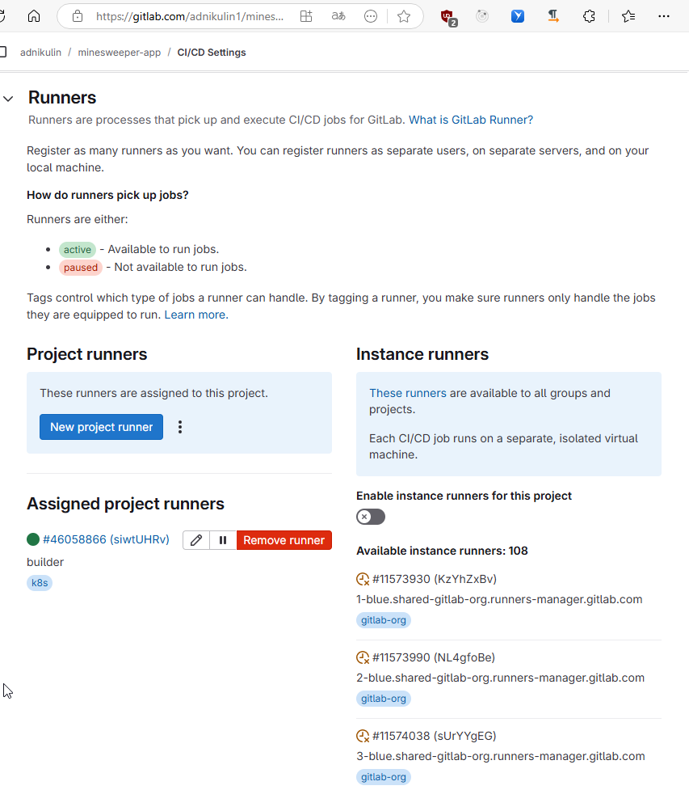
  > - 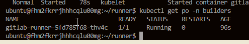
  > \
  > Теперь разберемся со сборкой и деплоем. Сам по себе прцоесс проходит в два этапа. Так же есть прцоесс тестирования и сборок под разные устройства. Но в нашем случае это будет исключительно сборка в докер хаб и деплой в нашем кластере под браузер. Особо заморачиваться не будем. Поэтому был подготовлен [gitlab-ci.yaml](https://github.com/ADNikulin/diplom-app/blob/master/.gitlab-ci.yml). 
  > Структура файла простоя. В нем есть стейдж сборки и деплоя: 
  > - build. Пытался сначала собрать всё через классический подход который [предлагает](https://github.com/ADNikulin/diplom-app/blob/master/.gitlab-ci.yml) gitlab Но были проблемы со сборкой. По этому на их же сайте нашел [using_kaniko](https://docs.gitlab.com/ci/docker/using_kaniko/). В общем в самом файле в переменных готовим имя проекта который будет собираться, готовим лейблы. Так как нет четких условиях по веткам, то будем мобирать любой коммит и отправлять в докер хаб, в качестве лейбла будет хеш коммита, и в любом случае будет заменяться latest лейбл на последний успешный собранный образ. Так же если будет указан тег в репозитории, то будет проихсодить сборка с лейблом этого тега. Что в принципе удовлетворяет поставленным условиям. Готовим глобальные переменные которые будут браться из самого gitlab. Укажем репу с регистри, имя пользователя, токен. пропишем всё там и проверим как работает сборка и пуш его в регистри.
  > - 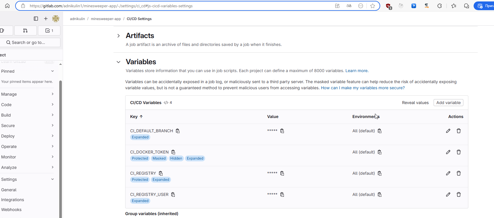
  > - После первого же коммита, пошла сборка. (фейлы и настройку самого файла опущу, поокажу сразу успешные варианты)
  > - Успешная сборка 
  > - 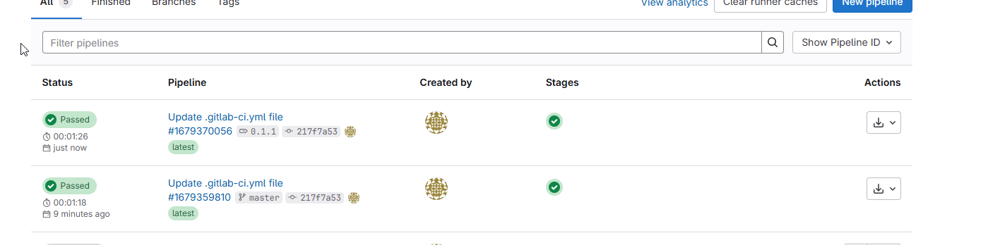
  > - + затегал сборку с новой версией
  > - 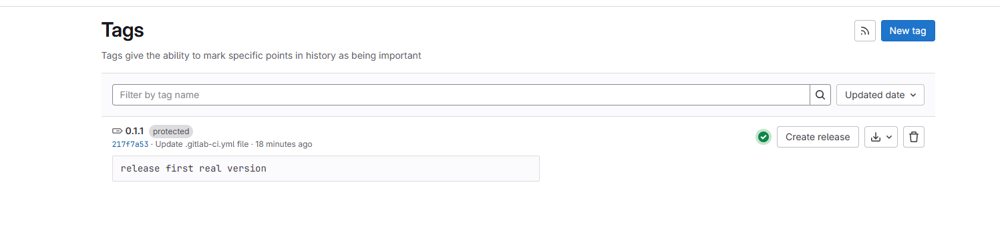
  > - проверяем в регистри
  > - 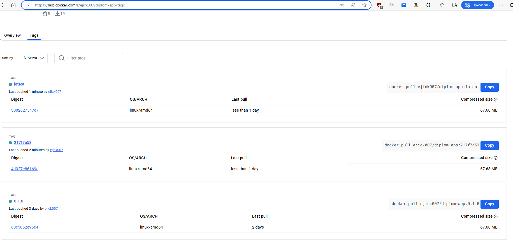
  > - 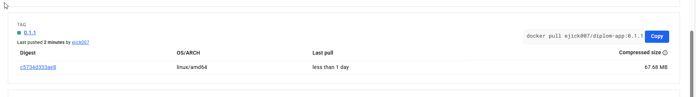
  > \
  > Далее настроем стадию деплая в [gitlab-ci.yaml](https://github.com/ADNikulin/diplom-app/blob/master/.gitlab-ci.yml) \
  > - Для данного подхода будем использовать bitnami/kubectl. Так же внесем конфиг kubeconfig в глобальыне переменные в виде base64 формата, а в деплое файле раскодируем обратно и положим в переменную KUBECONFIG. ТАким образом получим управление кластером. В идеале наверное надо было сделать своего пользователя со своими правами и вешать на каждого на свой раннер (prod, develop и т.п.), маркировать тегами раннеры и ветки и делать четкое соотвествие кому и что можн озапускать. Но думаю что тут можно это опустить. так что теги для всех будут k8s и конфиг будет админский. Далее импоьзуем файлы [деплоя](https://github.com/ADNikulin/diplom-app/tree/master/deploy) и в конфиге подставим правильные лейблы и имя образа из стеджа билда + свои дял данног овида сборки. В целом тут тоже можно определять неймспейсы и т.п. в зависимости от ветки, но для простоты будем использовать везде production неймспес. Так же будем использовать `rollout restart` для применения обновления приложения. 
  > - 
  > - После коммита запускается сборка
  > - 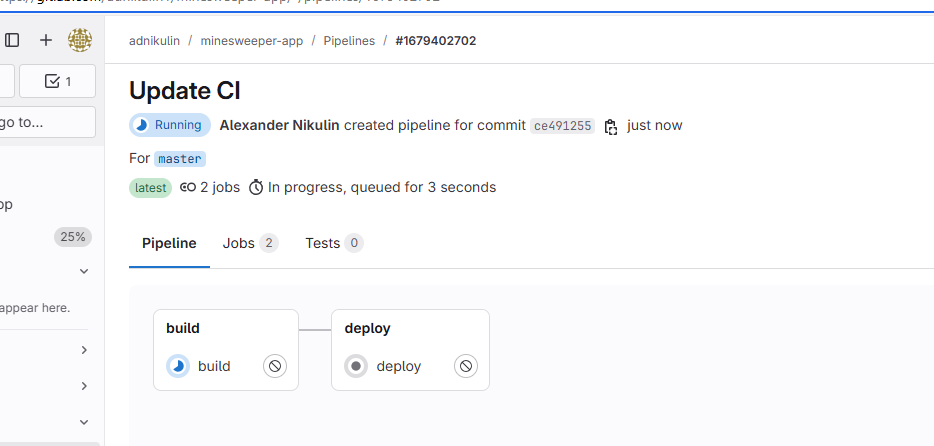
  > - 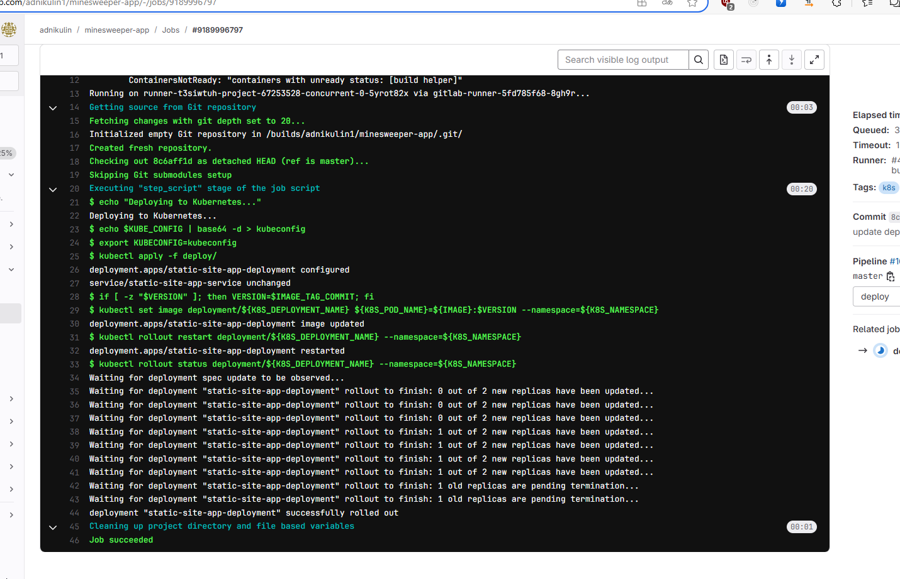
  > - 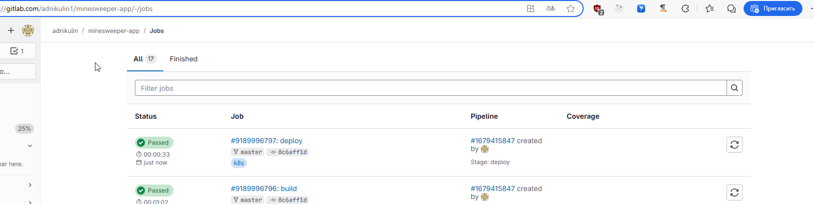
  > - Проверяем теперь доступность приложения
  > - 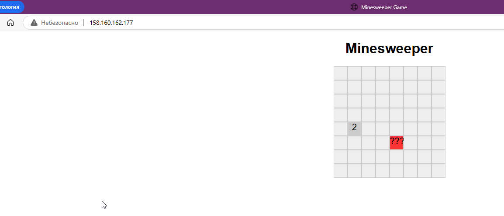
  > \
  > Приложение доступно. Теперь проведем ряд экспериментов по коммитам и деплою. 
  > - Внесем изменения в код, закомитим и проверим результаты:
  > - 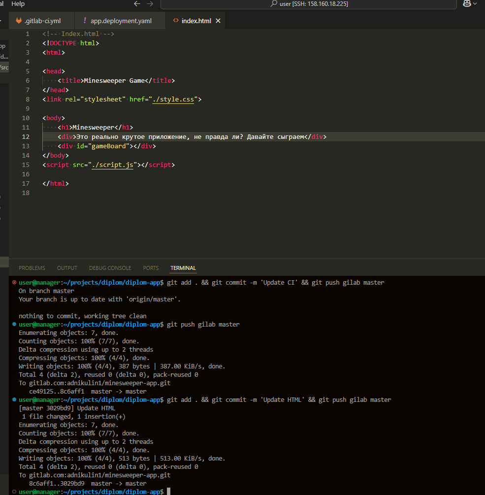
  > - 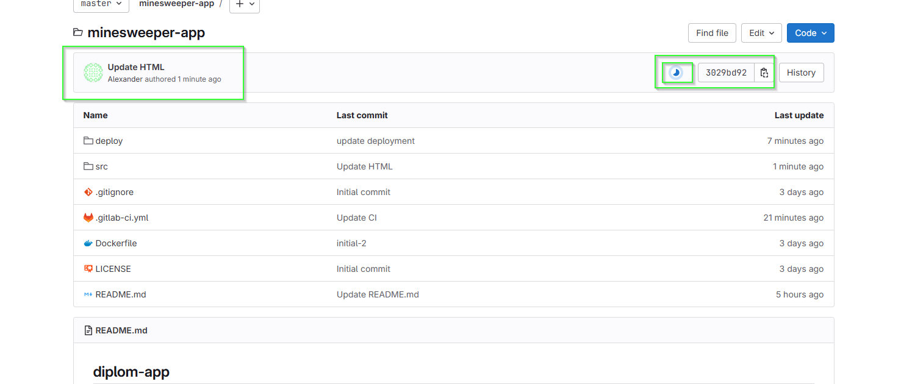
  > - 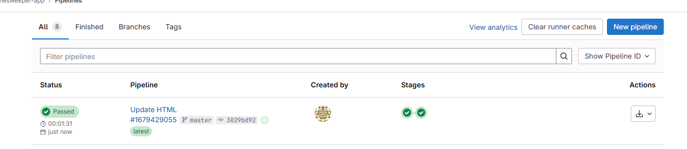
  > - 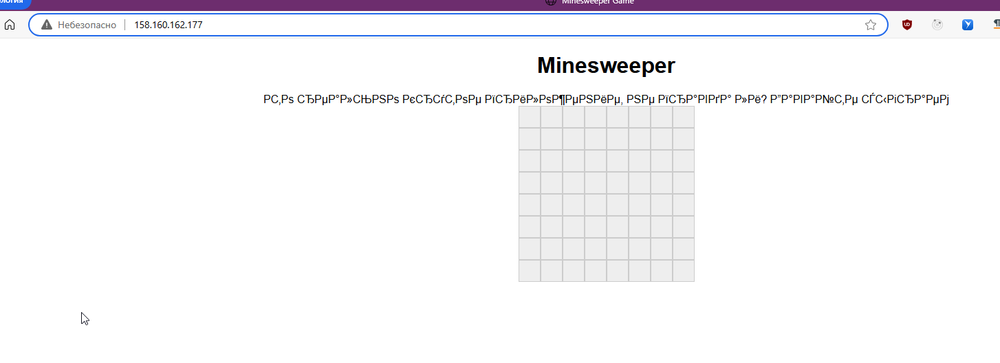
  > Работает, приложение обновилось. Но правда получилась ошибка с кодировкой. Выпустим ещё одну версию, только в этот раз с тегом 0.2.0 и проверим что на бою: 
  > - 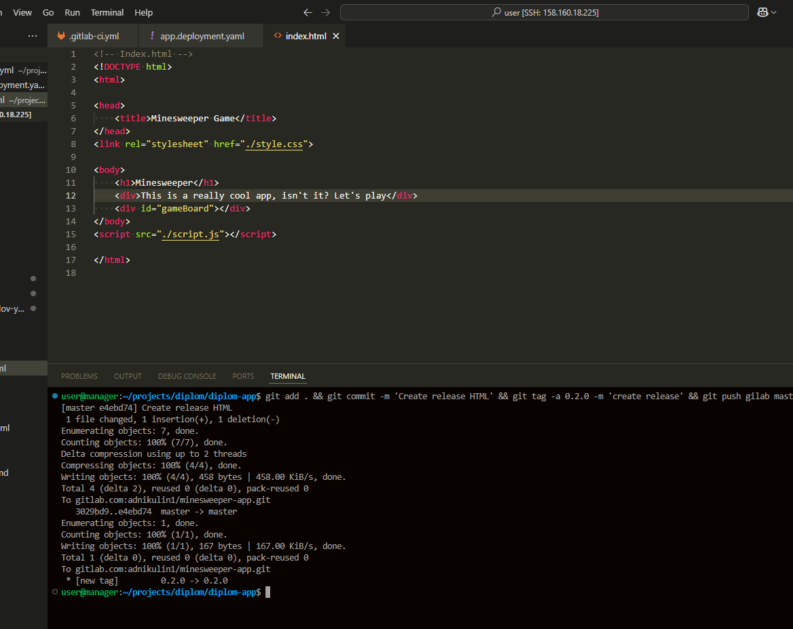
  > - 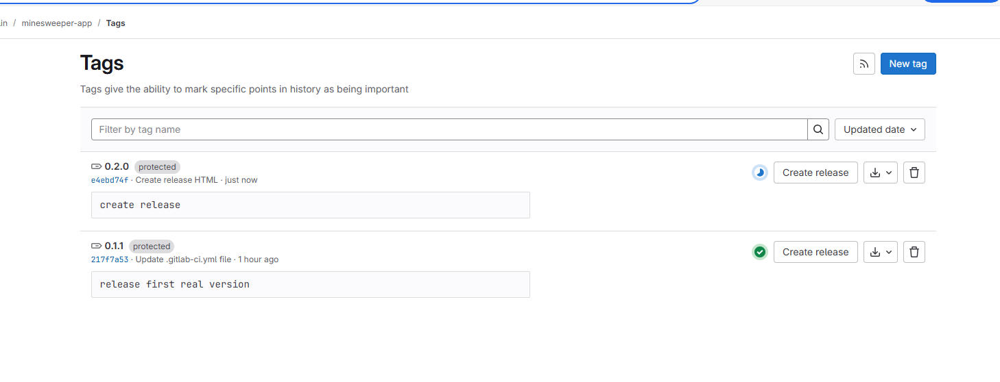
  > - 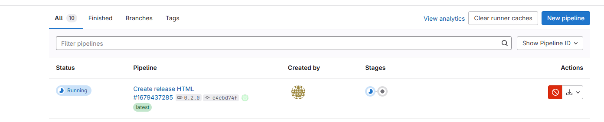
  > - 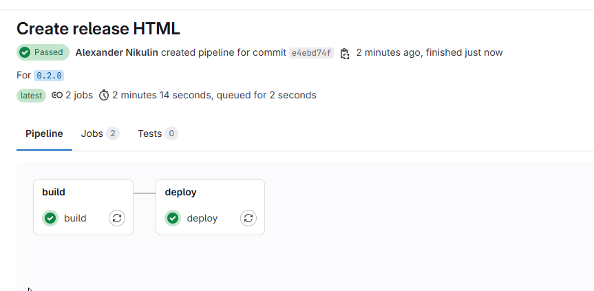
  > - 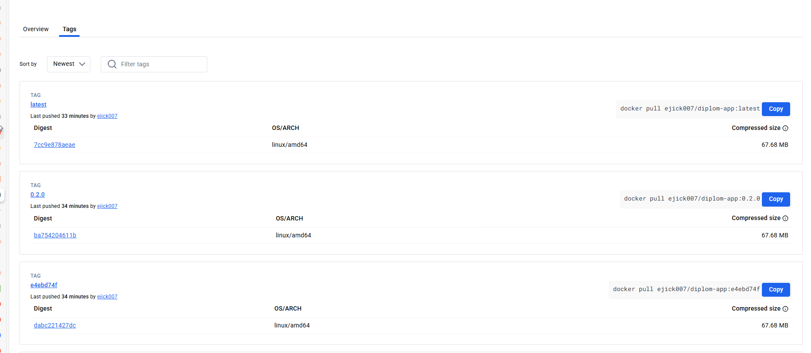
  > - 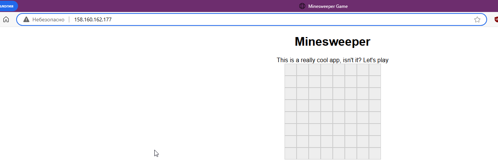
  > Всё работает и пушится в регистри докерхаба.
  > \
  > Результаты этапа
  > 1. Интерфейс ci/cd сервиса доступен по http - https://gitlab.com/adnikulin1/minesweeper-app/-/pipelines.
  > 2. При любом коммите в репозиторие с тестовым приложением происходит сборка и отправка в регистр Docker образа - сборки в докерхабе - https://hub.docker.com/repository/docker/ejick007/diplom-app/general.
  > 3. При создании тега (например, v1.0.0) происходит сборка и отправка с соответствующим label в регистри, а также деплой соответствующего Docker образа в кластер Kubernetes.
  > - [dockerhub - 0.2.0](https://hub.docker.com/repository/docker/ejick007/diplom-app/tags/0.2.0/sha256-ba754204611bdc5cecae2cdf4b9ba5d9d30e7a2bd6a325c9408f6320bfe10998)
  > - [Сборка и тег в гитлабе](https://gitlab.com/adnikulin1/minesweeper-app/-/pipelines/1679437285)
</details>

---
## Что необходимо для сдачи задания?

<details>
  <summary>Задача</summary>

  1. Репозиторий с конфигурационными файлами Terraform и готовность продемонстрировать создание всех ресурсов с нуля.
  2. Пример pull request с комментариями созданными atlantis'ом или снимки экрана из Terraform Cloud или вашего CI-CD-terraform pipeline.
  3. Репозиторий с конфигурацией ansible, если был выбран способ создания Kubernetes кластера при помощи ansible.
  4. Репозиторий с Dockerfile тестового приложения и ссылка на собранный docker image.
  5. Репозиторий с конфигурацией Kubernetes кластера.
  6. Ссылка на тестовое приложение и веб интерфейс Grafana с данными доступа.
  7. Все репозитории рекомендуется хранить на одном ресурсе (github, gitlab)
  
</details>

<details>
  <summary>Решение</summary>

  1. Репозиторий с конфигурационными файлами Terraform и готовность продемонстрировать создание всех ресурсов с нуля.
     - https://github.com/ADNikulin/devops-diplov-yandexcloud/tree/master/src
  2. Пример pull request с комментариями созданными atlantis'ом или снимки экрана из Terraform Cloud или вашего CI-CD-terraform pipeline.
     - Не совсем понял... С учетом того что шел по заданию и не использовал терраформ клауд (пошел по пути 1.2.а), все подробно в первом этапе расписано. 
  3. Репозиторий с конфигурацией ansible, если был выбран способ создания Kubernetes кластера при помощи ansible.
     - Использовался [Kubespray](https://kubernetes.io/docs/setup/production-environment/tools/kubespray/)
  4. Репозиторий с Dockerfile тестового приложения и ссылка на собранный docker image.
     - https://github.com/ADNikulin/diplom-app/blob/master/Dockerfile
     - https://hub.docker.com/repository/docker/ejick007/diplom-app/tags/0.2.0/sha256-ba754204611bdc5cecae2cdf4b9ba5d9d30e7a2bd6a325c9408f6320bfe10998
  5. Репозиторий с конфигурацией Kubernetes кластера.
     - https://github.com/ADNikulin/devops-diplov-yandexcloud/blob/master/src/kubspray-inventory/hosts.yaml
  6. Ссылка на тестовое приложение и веб интерфейс Grafana с данными доступа.
     - http://158.160.159.211/
     - admin / qweqwe@!123
  7. Все репозитории рекомендуется хранить на одном ресурсе (github, gitlab)
     - https://github.com/ADNikulin/devops-diplov-yandexcloud/tree/master/src - terraform
     - https://github.com/ADNikulin/diplom-app/blob/master/README.md - app

</details>